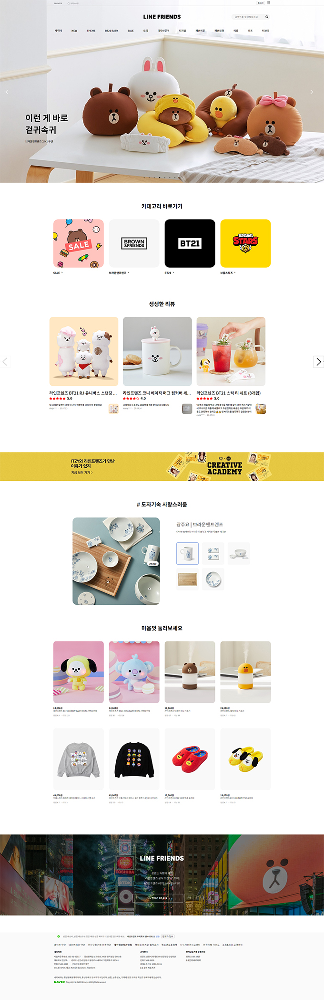
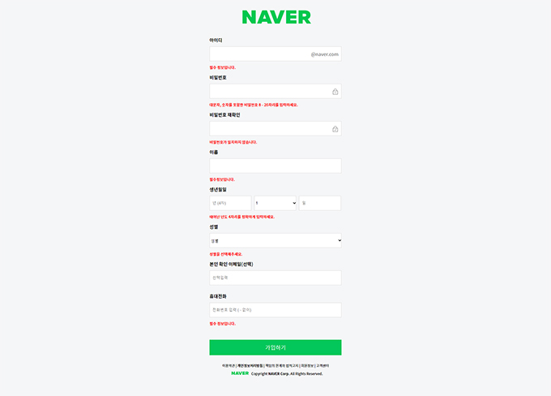
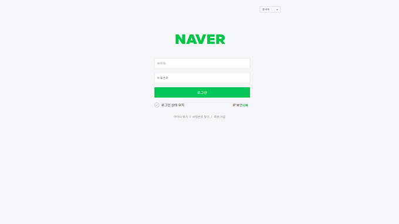
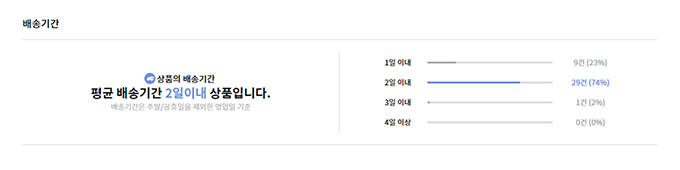

<iframe src="https://player.vimeo.com/video/462291088" width="680" height="400" frameborder="0" allow="autoplay; fullscreen" allowfullscreen></iframe>

### 🙌 Front-end

- `React.js`를 이용한 라인프렌즈스토어 클론
- `CRA(create-react-app)`를 사용한 초기 세팅
- `Git`을 사용한 팀 협업 과정
- `MockData`를 이용하여 UI 구현 후 `componentDidMount()`와 `fetch()`를 이용해 백엔드와의 통신
- `trello`를 활용한 스크럼 방식 아래 프로젝트 진행
- `localStorage`와 `token`을 이용한 로그인 기능 구현
- `query string, path`로 동적 라우팅과 Pagination 구현
- Code refactoring

### 🙌 Back-end

- 1
- 2
- 3
- 4

### 🎉 프로젝트 기간

- 2020.09.14 ~ 2020.09.25

### 🛸 사용 기술

<p className="box" style="padding: 20px 30px">

### Front-end

<br/>
React
<br/>
JavaScript
<br/>
SASS
<br/>
Git

### Back-end

<br/>

</p>

### 🚀 구현 기능

&nbsp;&nbsp;**메인 페이지**


<br/>

- 슬라이드 `fade-in / fade out`
- 유효성 검사 확인
- `withRouterHOC` 로 페이지 이동 구현 - `this.props.history.push('/signup')`
- 서버와의 통신 `fetch()`
- media query를 이용한 반응형 구현
- `MockData`와 `map()`을 활용해 sitemap 구현

&nbsp;&nbsp;**회원가입, 로그인 페이지**


<br/>

<br/>

- 아이디, 이름
- at least one character
- 비밀번호
- 8-20자리 대문자, 숫자 포함
- 비밀번호 재확인
- 비민번호와 동일
- 생년월일
- 연도 - 4자리 숫자
- 월 - 1-12월 선택
- 일 - 1-31일까지 숫자
- 성별
- 남성/여성/선택안함 중 택 1
- 본인확인 이메일 (선택)
- 선택이기 때문에 빈칸 입력 가능
- 휴대전화
- ‘-’ 없이 11자리 입력
- token을 활용한 로그인

&nbsp;&nbsp;**상품 리스트 페이지**


<br/>

- map함수를 이용한 아이템 정렬
- 필터에 따른 아이템 정렬 기능 구현
  (서버 연결 전에는 mock data를 sort함수로 분류했고,
  서버 연결 후에는 queryString 이용한 fetch 함수를 이용하였다.)
- 리스트뷰,이미지뷰,큰이미지뷰,갤러리뷰 4가지의 뷰스타일 전환
- 상품 리스트 출력개수 선택에 따른 페이지네이션
- 찜하기 기능 구현
- 상품 클릭 시 해당 상품 페이지로 이동
- 토글 버튼 구현

&nbsp;&nbsp;**상품 상세정보 페이지**


<br/>

- Price 데이터로 적립금, 옵션 선택 시 총합 계산
- 데이터 차트 구현
- 스크롤에 따른 sticky nav구현
- 스크롤에 따른 sticky nav 색상 변화 및 클릭 시 특정 스크롤 이동 기능 구현
- 옵션 선택 기능 및 수량 추가에 따른 가격 계산 기능 구현
- sticky nav와 가격 및 옵션 자동 연동
- 마우스 hover시 제품 상세 이미지 변화
- 데이터 통신으로 보여주는 상품정보 테이블
- 포토리뷰 간략보기 4개씩 보여주기
- 리뷰 모달창
- 별점평가 및 리뷰 작성 기능

### ✍ 기억하고 싶은 코드

```jsx
class InformationTab extends Component {

  ...

  render() {
    retrun (
      ...
        <ul className="chart">
          {SHIP_DATA.map((data, index) => {
            const { id, option, count } = data;
            let ratio = parseInt((count / getTotalCount()) * 100);
            return (
              <li key={id}>
                <span className="option">{option}</span>
                <div className="line">
                  <div
                    className={
                      getMaxInCount() === index
                        ? 'activeLine max'
                        : 'activeLine'
                    }
                    style={{ width: `${ratio}%` }}
                  />
                  <div className="backgroundLine"></div>
                </div>
                <span
                  className={
                    getMaxInCount() === index ? 'count max' : 'count'
                  }
                >{`${count}건 (${count ? ratio : 0}%)`}</span>
              </li>
            );
          })}
        </ul>
      ...
    )
  }
}

function getTotalCount() {
  let counts = [];

  for (let data of SHIP_DATA) {
    counts.push(data.count);
  }

  return counts.reduce((accumulator, count) => accumulator + count, 0);
}

function getMaxInCount() {
  let max = 0;
  const counts = [];

  for (let data of SHIP_DATA) {
    counts.push(data.count);
  }

  max = Math.max(...counts);
  return counts.indexOf(max);
}
```


<br />

- `Reduce`메소드를 활용한 합계 계산
- 데이터 시각화 (chart)
